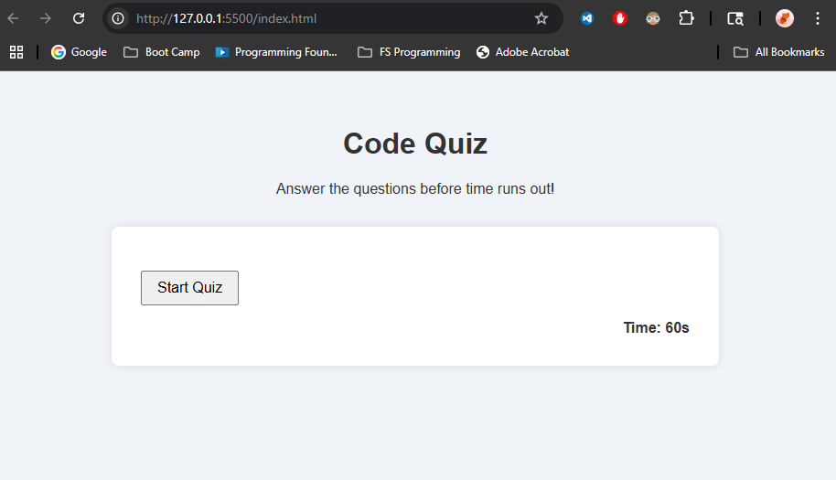
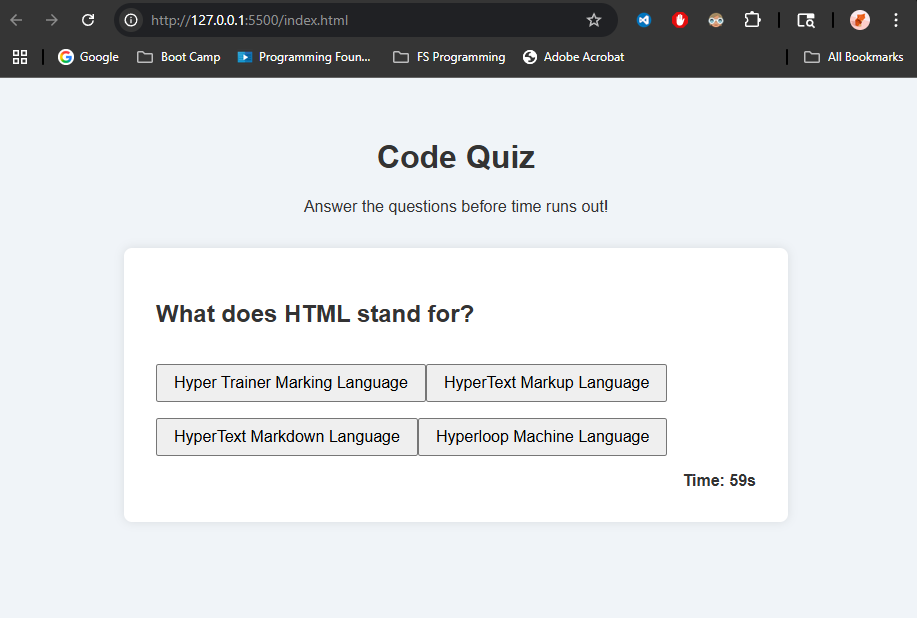

# Code Quiz 🧠

A timed multiple-choice coding quiz built with HTML, CSS, and JavaScript. Users are challenged with random questions and must answer before time runs out. Wrong answers penalize time, and the final score is calculated out of 100.

---

## 🔧 Features

- Dynamic JavaScript quiz logic
- Countdown timer
- Score calculation with penalties
- Final score summary
- Local storage for high scores
- Responsive layout

---

## 🚀 Technologies

- HTML5
- CSS3
- Vanilla JavaScript

---

## 📸 Screenshots

### Screenshot 1 – Start Screen


### Screenshot 2 – Quiz in Progress


### Screenshot 3 – Final Score + Submit


---

## 💾 Installation

1. Clone the repo:
   ```bash
   git clone https://github.com/itsyourpalsal18/04-code-quiz.git